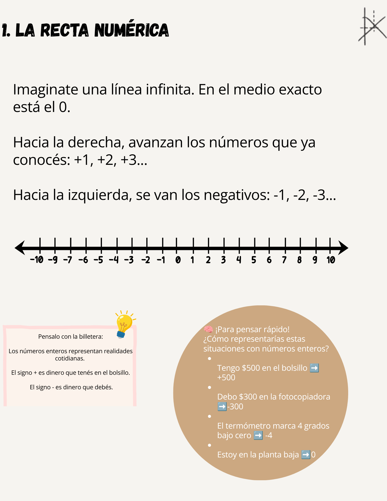
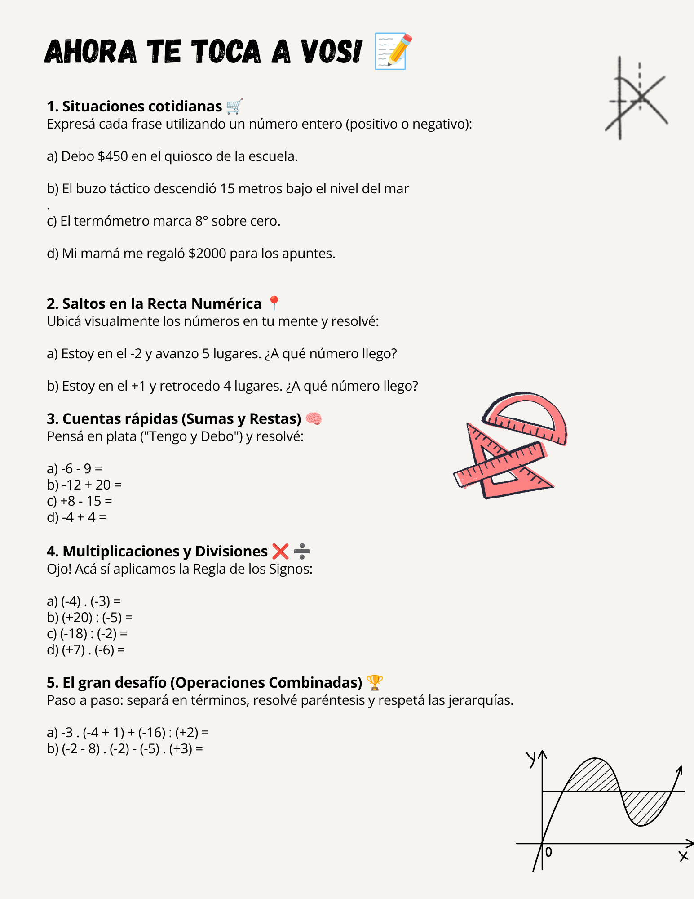
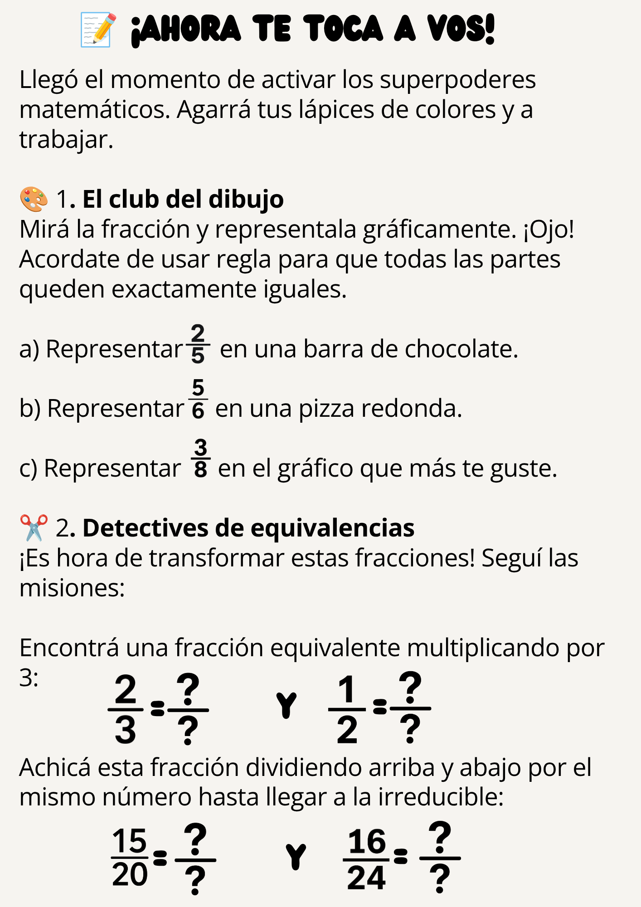

¡Bienvenido/a al repositorio de este recurso pedagógico! Este cuadernillo fue diseñado desde cero con un enfoque didáctico, empático y visual, pensado especialmente para estudiantes de educación secundaria. 

El objetivo principal es transformar contenidos tradicionalmente abstractos en aprendizajes significativos a través de analogías del día a día.

## 🎯 Enfoque Pedagógico y Características
* **Aprendizaje Contextualizado:** Uso de situaciones de la vida cotidiana (como la "lógica de la billetera" y estados de cuenta) para facilitar la comprensión de los números negativos.
* **Diseño Visual e Intuitivo:** Maquetación limpia y moderna realizada en Canva para captar la atención del estudiante y guiar la lectura.
* **Estructura Paso a Paso:** Explicaciones claras que desarman ejercicios complejos (como operaciones combinadas) en bloques simples.
* **Guía Práctica:** Incluye secciones de ejercitación ("¡Ahora te toca a vos!") para fijar los conocimientos adquiridos.

# 📚 Números Enteros (Unidad I)

## 📖 Contenidos de la Unidad
1. **La Recta Numérica:** Ubicación espacial y concepto de números negativos.
2. **Sumas y Restas:** Manejo de signos bajo el concepto de "Tengo y Debo" (sin abusar de la regla de signos en la adición).
3. **Multiplicación y División:** Aplicación correcta de la Regla de los Signos.
4. **Operaciones Combinadas:** Jerarquía de operaciones y separación en términos.

## 📂 Vista Previa del Material

# 📚 Números Racionales (Unidad II)

## 📖 Contenidos de la Unidad
1.**Concepto y gráficos:** Qué es una fracción, cómo se lee y cómo dibujarla sin morir en el intento.
2.**Fracciones Equivalentes:** Cómo escribir el mismo número de formas distintas y el secreto de la simplificación (achicar la fracción para hacernos la vida más fácil).
3.**El gran cambiazo:** Cómo pasar de fracción a número decimal (con coma) y al revés, para usar lo que más te convenga en cada cuenta.
4.**Operaciones sin drama:** Sumar, restar, multiplicar y dividir fracciones usando trucos rápidos para no marearte con los números de abajo.
## 📂 Vista Previa del Material
### Teoría y Hoja de Ruta

### Ejercitación Práctica ("¡Ahora te toca a vos!")

